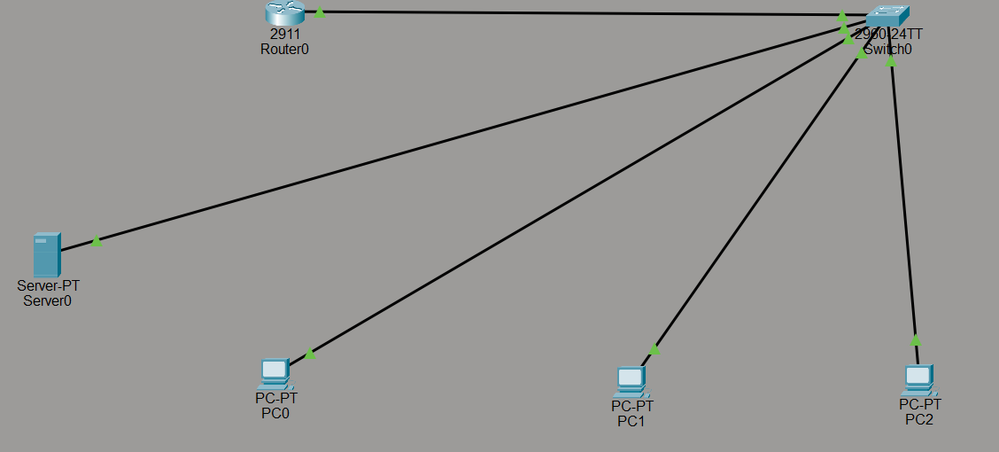

# Enterprise LAN Segmentation & Inter-VLAN Routing Security

## 📌 Project Overview
This project demonstrates enterprise network segmentation and inter-VLAN routing security using Cisco Packet Tracer. By configuring VLANs, Router-on-a-Stick (802.1Q encapsulation), and Extended Access Control Lists (ACLs), unauthorized guest traffic is strictly isolated and blocked from accessing sensitive internal subnets and enterprise server resources while maintaining full connectivity for authorized personnel.

---

## 📐 Network Topology & Addressing Table

| Device / Segment | VLAN ID | Subnet Network | Sub-interface | IP Address | Gateway |
| :--- | :--- | :--- | :--- | :--- | :--- |
| **Management (PC0)** | VLAN 10 | `192.168.10.0/24` | `Gi0/0.10` | `192.168.10.10/24` | `192.168.10.1` |
| **Employees (PC1)** | VLAN 20 | `192.168.20.0/24` | `Gi0/0.20` | `192.168.20.10/24` | `192.168.20.1` |
| **Guests (PC2)** | VLAN 30 | `192.168.30.0/24` | `Gi0/0.30` | `192.168.30.10/24` | `192.168.30.1` |
| **Servers (Server0)** | VLAN 50 | `192.168.50.0/24` | `Gi0/0.50` | `192.168.50.10/24` | `192.168.50.1` |


*Figure 1: Enterprise Network Topology showing VLAN Segmentation and Inter-VLAN Routing*

---

## ⚙️ Key Implementation Steps

### 1. Switch VLAN & Trunking Setup (`Switch0`)
Configured access ports for end devices and established an 802.1Q trunk link on `GigabitEthernet0/1` to carry multi-VLAN traffic to the router:
```text
vlan 10
 name Management
vlan 20
 name Employees
vlan 30
 name Guests
vlan 50
 name Servers

interface FastEthernet0/1
 switchport mode access
 switchport access vlan 10

interface FastEthernet0/2
 switchport mode access
 switchport access vlan 20

interface FastEthernet0/3
 switchport mode access
 switchport access vlan 30

interface FastEthernet0/10
 switchport mode access
 switchport access vlan 50

interface GigabitEthernet0/1
 switchport mode trunk
